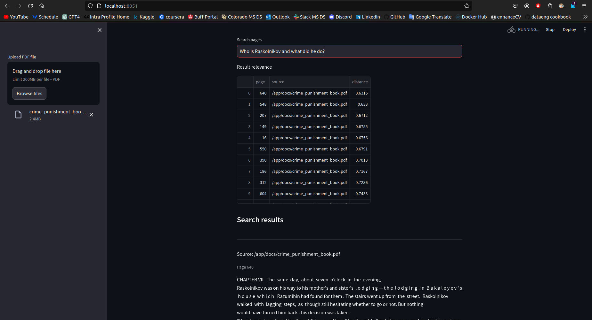

### How to run

```bash
docker compose -f docker-compose-stage.yaml up
```
Web UI will be located at ``localhost:8051``

### Usage



## TODOs

#### current tasks:
1) Write unit-tests for backend and put them to CI pipeline
2) Make search to be RAG. (Add LLM on top of generated docs)
3) Migrate from Streamlit to classic frontend (**NextJS + HTML**)

   

#### Long-term imortant things:
1) Switch from streamlit to nextJS and normal frontend
2) Add LLM and turn app to be RAG (Retrieval Augmented Generation)
3) Store files in localstack (local AWS S3)
4) Add authorization
5) Add other formats apart PDF (doc, txt, pptx etc)
6) **Migrate fully to Langchain** - **IN PROGRESS**
   
##### may be needed later:
1) Store logs in ELK stack
2) Handle multiple collections
3) Record info about users to Relational DB

#### Notes for improving RAG  
   1) Query augmentation with LLM
   2) Cross encoder to score retrieved docs
   3) Use langsmith to monitor chain
   4) Routing between databases/promts
